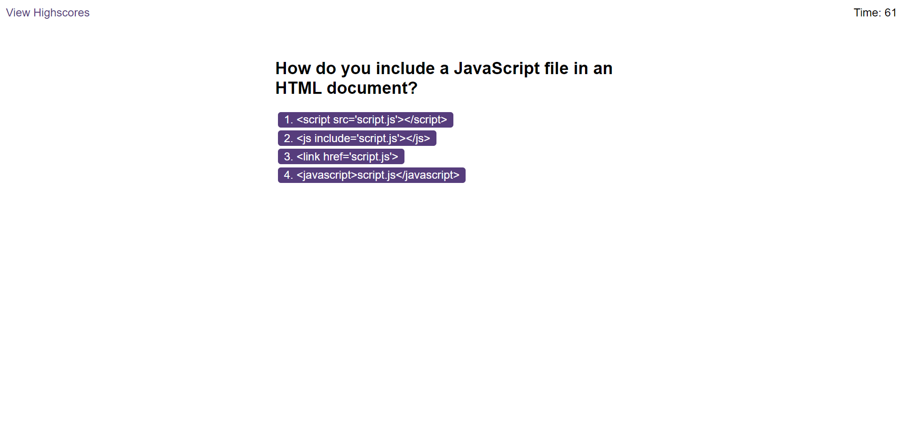

# JavaScript Quiz App

## Overview

This JavaScript Quiz App is a simple web application, built using HTML, CSS, and JavaScript. that challenges users to answer 10 JavaScript-related questions within a time limit of 75 seconds. The quiz features a dynamic question generator and a scoring mechanism where users lose 10 seconds for each incorrect answer. The final score is determined by the remaining time after completing all questions.

# Features

- Dynamic random question generation.
- Countdown timer with a deduction for incorrect answers.
- Highscores storage using local storage.
- Responsive design for various screen sizes.

## Preview

You Can see a live demo [here](https://danilorua.github.io/Code-quiz)